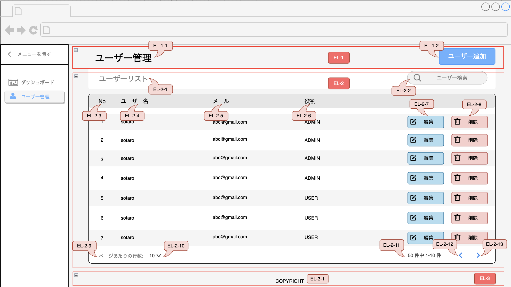

## ユーザ管理画面

### 概要

新しいユーザー管理画面を開発するためのタスクです。この画面には以下の機能が含まれています。

1. ***ユーザー一覧*** : システムに登録されている全てのユーザーのリストを表示します。各ユーザーには、一意の番号、ユーザー名、メールアドレスがあります。
2. ***ロール*** : ユーザーのシステム内の役割を示します。例えば 'ADMIN' は管理者で、'USER' は一般ユーザーを意味します。
3. ***編集・削除機能*** : 各ユーザー情報の右側にある '編集' と '削除' のボタンにより、管理者はユーザーの情報を編集または削除することができます。
4. ***ページネーション*** : ユーザーのリストをページ分けして表示し、ページ間のナビゲーションを容易にします。

### 画面設計のレイアウト

---

### 画面設計版

#### ヘッダー説明

| ID     | 名称           | テキスト   | 入力データ | エンティティ | 項目   | 位置 | サイズ | 背景色                | 文字色         | イベント             | 参考 |
|--------|--------------|--------|-------|--------|------|----|-----|--------------------|-------------|------------------|----|
|        |              |        |       |        |      |    |     |                    |             |                  |    |
| EL-1-1 | ユーザー管理画面タイトル | ユーザー管理 | -     | -      | ヘッダー | 左  | -   | -                  | 黒色 (#000000) | -                | -  |
| EL-1-2 | ユーザー追加       | ユーザー追加 | -     | -      | ボタン  | 右  | -   | 青（007FFF） | 白（#FFFFFF）  | [EVT-1](#イベント説明) | -  |

#### ボディー説明

| ID      | 名称         | テキスト            | 入力データ | エンティティ    | 項目       | 位置    | サイズ | 背景色          | 文字色          | イベント             | 参考 |
|---------|------------|-----------------|-------|-----------|----------|-------|-----|--------------|--------------|------------------|----|
| EL-２    | ボディー部品     | -               | -     | -         | -        | -     | -   | -            | -            | -                | -  |
| EL-2-1  | ユーザー一覧タイトル | ユーザー一覧          | -     | -         | ヘッダー     | 上部（右） | -   | -            | 黒色 (#000000) | -                | -  |
| EL-2-2  | 検索バー       | 検索              | -     | -         | 入力フィールド  | 上部（左） | -   | -            | -            | [EVN-5](#イベント説明) | -  |
| EL-2-3  | No         | No              | -     | `AppUser` | テキスト     | フレクス  | -   | -            | 黒色 (#000000) | -                | -  |
| EL-2-4  | ユーザー名      | ユーザー名           | -     | `AppUser` | テキスト     | フレクス  | -   | -            | 黒色 (#000000) | -                | -  |
| EL-2-5  | メール        | メールアドレス         | -     | `AppUser` | テキスト     | フレクス  | -   | -            | 黒色 (#000000) | -                | -  |
| EL-2-6  | 役割         | 役割              | -     | `AppUser` | テキスト     | フレクス  | -   | -            | 黒色 (#000000) | -                | -  |
| EL-2-7  | 編集         | 編集              | -     | `AppUser` | ボタン      | 右     | -   | 青色 (#66B2FF) | -            | [EVN-1](#イベント説明) | -  |
| EL-2-8  | 削除         | 削除              | -     | `AppUser` | ボタン      | 右     | -   | 赤色 (#F8CECC) | -            | [EVN-2](#イベント説明) | -  |
| EL-2-9  | ページあたりの行数  | ページあたりの行数       | -     | `AppUser` | テキスト     | 左     | -   | -            | -            | -                | -  |
| EL-2-10 | 表示件数選択     | 表示件数選択          | -     | `AppUser` | セレクトボックス | 左     | -   | -            | -            | [EVN-6](#イベント説明) | -  |
| EL-2-11 | 合計表示       | `...`件中`1-...`件 | -     | `AppUser` | ボタン      | 右     | -   | -            | -            | -                | -  |
| EL-2-12 | 前へ         | 前へ              | -     | `AppUser` | ボタン      | 右     | -   | -            | -            | [EVN-3](#イベント説明) | -  |
| EL-2-13 | 次へ         | 次へ              | -     | `AppUser` | ボタン      | 右     | -   | -            | -            | [EVN-4](#イベント説明) | -  |

#### フッター説明

| ID     | 名称      | テキスト      | 入力データ | エンティティ | 項目 | 位置  | サイズ | 背景色 | 文字色          | イベント | 参考 |
|--------|---------|-----------|-------|--------|----|-----|-----|-----|--------------|------|----|
| EL-3   | 　フッター部品 | -         | -     | -      | -  | -   | -   | -   | -            | -    | -  |
| EL-3-1 | フッター 名称 | CopyRight | -     | -      | -  | 　中央 | -   | -   | 黒色 (#000000) | -    | -  |

---

#### イベント説明

| ID    | イベント名称   | 動作            | 説明                                                                                | API             | リンク | 参考 |
|-------|----------|---------------|-----------------------------------------------------------------------------------|-----------------|-----|----|
| EVT-1 | ユーザー追加   | 新しいユーザーを追加する	 | ユーザー追加ボタンをクリックすると、新しいユーザーをシステムに追加するためのモーダルが表示される                                  | [API-1](#API一覧) | -   | -  |
| EVT-2 | ユーザー編集   | ユーザー情報を編集する   | 編集ボタンをクリックすると、選択されたユーザーの情報を編集するためのフォームが表示される                                      | [API-2](#API一覧) | -   | -  |
| EVT-3 | ユーザー削除   | ユーザーを削除する     | 削除ボタンをクリックすると、システムから選択されたユーザーが削除される                                               | [API-3](#API一覧) | -   | -  |
| EVT-4 | ページネーション | ページを切り替える     | 前へ・次へボタンをクリックすると、ユーザーリストの異なるページに移動する                                              | [API-4](#API一覧) | -   | -  |
| EVT-5 | ユーザー検索   | ユーザーを検索する     | 検索バーにテキストを入力して検索ボタンをクリックすると、入力されたテキストに基づいてユーザーを検索する                               | [API-4](#API一覧) | -   | -  |
| EVT-6 | 表示件数選択   | 表示件数選択        | - データのどの行からどの行まで表示を選択する   - セレクトボックスにロードされるデータは、***API-4*** から取得した総記録数に基づいている | [API-4](#API一覧) | -   | -  |

#### API一覧 （Element対応）

| ID    | 名称                     | メソット   | リクエスト                 | レスポンス                                     | リンク                                        | 参考 |
|-------|------------------------|--------|-----------------------|-------------------------------------------|--------------------------------------------|----|
| API-1 | ユーザー追加API              | POST   | ユーザー情報（名前、メールなど）      | 追加したユーザーの情報                               | `**server-IP:port**/api/v1/create`         | -  |
| API-2 | ユーザー情報編集API            | PUT    | 編集するユーザーのIDと新しい情報     | 更新されたユーザーの情報                              | `**server-IP:port**/api/v1/update`         | -  |
| API-3 | ユーザー削除API              | DELETE | 削除するユーザーのID           | 削除が成功したかどうかのステータス                         | `**server-IP:port**/api/v1/delete`         | -  |
| API-4 | ページネーションAPI /ユーザー検索API | GET    | 現在のページ番号、ページサイズ、検索クエリ | - そのページのユーザーリスト  - 検索クエリにマッチするユーザーリスト | `**server-IP:port**/api/v1/read?q=[query]` | -  |
