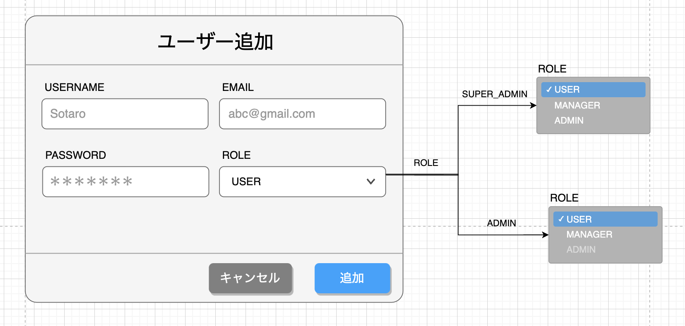
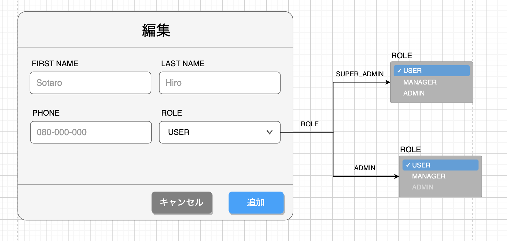
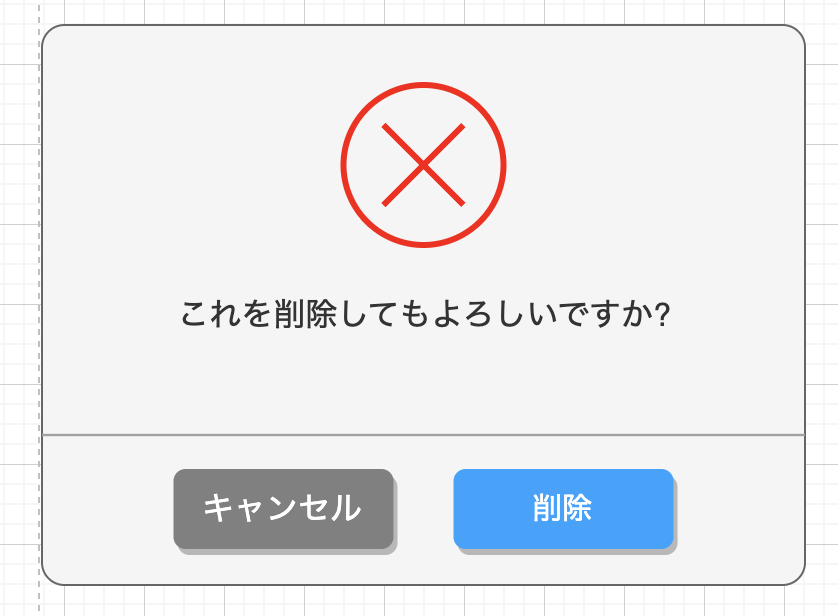
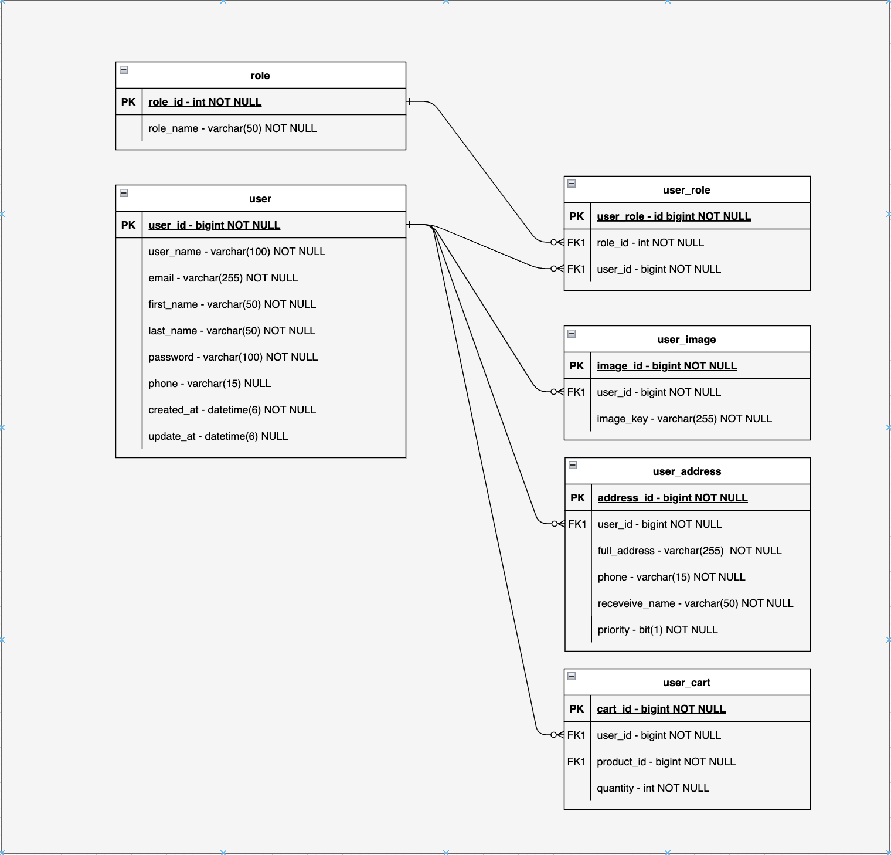

## ユーザ管理画面

### 概要

新しいユーザー管理画面を開発するためのタスクですこの画面には以下の機能が含まれています

1. ***ユーザー一覧*** :
    - システムに登録されている全てのユーザーのリストを表示します各ユーザーには、一意の番号、ユーザー名、メールアドレスがあります
2. ***ロール*** :
    - ユーザーのシステム内の役割を示します例えば 'ADMIN' は管理者で、'USER' は一般ユーザーを意味します
3. ***編集・削除機能*** :
    - 各ユーザー情報の右側にある '編集' と '削除' のボタンにより、管理者はユーザーの情報を編集または削除することができます
4. ***ページネーション*** :
    - ユーザーのリストをページ分けして表示し、ページ間のナビゲーションを容易にします

### 画面設計のレイアウト

---

### 画面設計版

#### ヘッダー説明

| ID     | 名称           | テキスト   | 入力データ | エンティティ | 項目   | 位置 | サイズ | 背景色       | 文字色          | イベント             | 参考 |
|--------|--------------|--------|-------|--------|------|----|-----|-----------|--------------|------------------|----|
| EL-1   | ヘッダー部品       | -      | -     | -      | -    | -  | -   | -         | -            | -                | -  |
| EL-1-1 | ユーザー管理画面タイトル | ユーザー管理 | -     | -      | ヘッダー | 左  | -   | -         | 黒色 (#000000) | -                | -  |
| EL-1-2 | ユーザー追加       | ユーザー追加 | -     | -      | ボタン  | 右  | -   | 青（007FFF） | 白（#FFFFFF）   | [EVT-1](#イベント説明) | -  |

#### ボディー説明

| ID      | 名称         | テキスト            | 入力データ | エンティティ    | 項目       | 位置    | サイズ | 背景色          | 文字色          | イベント             | 参考 |
|---------|------------|-----------------|-------|-----------|----------|-------|-----|--------------|--------------|------------------|----|
| EL-２    | ボディー部品     | -               | -     | -         | -        | -     | -   | -            | -            | -                | -  |
| EL-2-1  | ユーザー一覧タイトル | ユーザー一覧          | -     | -         | ヘッダー     | 上部（右） | -   | -            | 黒色 (#000000) | -                | -  |
| EL-2-2  | 検索バー       | 検索              | -     | -         | 入力フィールド  | 上部（左） | -   | -            | -            | [EVN-5](#イベント説明) | -  |
| EL-2-3  | No         | No              | -     | `AppUser` | テキスト     | フレクス  | -   | -            | 黒色 (#000000) | -                | -  |
| EL-2-4  | ユーザー名      | ユーザー名           | -     | `AppUser` | テキスト     | フレクス  | -   | -            | 黒色 (#000000) | -                | -  |
| EL-2-5  | メール        | メールアドレス         | -     | `AppUser` | テキスト     | フレクス  | -   | -            | 黒色 (#000000) | -                | -  |
| EL-2-6  | 役割         | 役割              | -     | `AppUser` | テキスト     | フレクス  | -   | -            | 黒色 (#000000) | -                | -  |
| EL-2-7  | 編集         | 編集              | -     | `AppUser` | ボタン      | 右     | -   | 青色 (#66B2FF) | -            | [EVN-2](#イベント説明) | -  |
| EL-2-8  | 削除         | 削除              | -     | `AppUser` | ボタン      | 右     | -   | 赤色 (#F8CECC) | -            | [EVN-3](#イベント説明) | -  |
| EL-2-9  | ページあたりの行数  | ページあたりの行数       | -     | `AppUser` | テキスト     | 左     | -   | -            | -            | -                | -  |
| EL-2-10 | 表示件数選択     | 表示件数選択          | -     | `AppUser` | セレクトボックス | 左     | -   | -            | -            | [EVN-6](#イベント説明) | -  |
| EL-2-11 | 合計表示       | `...`件中`1-...`件 | -     | `AppUser` | ボタン      | 右     | -   | -            | -            | -                | -  |
| EL-2-12 | 前へ         | 前へ              | -     | `AppUser` | ボタン      | 右     | -   | -            | -            | [EVN-4](#イベント説明) | -  |
| EL-2-13 | 次へ         | 次へ              | -     | `AppUser` | ボタン      | 右     | -   | -            | -            | [EVN-4](#イベント説明) | -  |

#### フッター説明

| ID     | 名称      | テキスト      | 入力データ | エンティティ | 項目 | 位置 | サイズ | 背景色 | 文字色          | イベント | 参考 |
|--------|---------|-----------|-------|--------|----|----|-----|-----|--------------|------|----|
| EL-3   | 　フッター部品 | -         | -     | -      | -  | -  | -   | -   | -            | -    | -  |
| EL-3-1 | フッター 名称 | CopyRight | -     | -      | -  | 中央 | -   | -   | 黒色 (#000000) | -    | -  |

---

#### イベント説明

| ID    | イベント名称   | 動作         | 説明                                                                                                                                                       | API             | リンク | 参考 |
|-------|----------|------------|----------------------------------------------------------------------------------------------------------------------------------------------------------|-----------------|-----|----|
| EVT-0 | 画面初期表示   | 高客画面を表示処理  | 各ロールに応じてApi-1から適切なデータを取得。 **ADMIN**: `200`: userList取得, `404`: データなし。 **SUPER_ADMIN**: `200`: 全アカウント取得, `404`: データなし。 **USER**: `401`: 認証解除。 | [API-1](#API一覧) | -   | -  |
| EVT-1 | ユーザー追加   | 新しいユーザーを追加 | ユーザー追加ボタンクリックで[追加モーダル](#ユーザー追加レアウトウト)表示。`はい`で追加、`キャンセル`や外側クリックでモーダル閉じる。                                                                                  | [API-1](#API一覧) | -   | -  |
| EVT-2 | ユーザー編集   | ユーザー情報を編集  | 編集ボタンクリックで選択したユーザーの情報を編集する[編集モーダル](#ユーザー編集レアウトウト)が表示されます。モーダルには、ユーザー情報を編集するためのフォームが含まれています。`保存`ボタンで変更を適用、`キャンセル`や外側クリックでモーダルを閉じることができます。                 | [API-2](#API一覧) | -   | -  |
| EVT-3 | ユーザー削除   | ユーザーを削除    | 削除ボタンクリックで[削除確認モーダ](#ユーザー編集レアウトウト)ル表示。`はい`で削除、`キャンセル`や外側クリックでモーダル閉じる。                                                                                    | [API-3](#API一覧) | -   | -  |
| EVT-4 | ページネーション | ページを切り替える  | 前へ・次へボタンでユーザーリストのページ移動。                                                                                                                                  | [API-4](#API一覧) | -   | -  |
| EVT-5 | ユーザー検索   | ユーザーを検索    | 検索バーに入力して検索ボタンクリックでテキストに基づくユーザー検索。                                                                                                                       | [API-4](#API一覧) | -   | -  |
| EVT-6 | 表示件数選択   | 表示件数を選択    | セレクトボックスで表示データ行数選択。データはAPI-4から取得した総記録数に基づく。                                                                                                              | [API-4](#API一覧) | -   | -  |

#### API一覧

| ID    | 名称                     | メソット   | リクエスト                               | レスポンス      | リンク                                        | 参考 |
|-------|------------------------|--------|-------------------------------------|------------|--------------------------------------------|----|
| API-1 | ユーザー追加API              | POST   | {userName, email, password}         | `201`コード   | `**server-IP:port**/api/v1/create`         | -  |
| API-2 | ユーザー情報編集API            | PUT    | {userId, fistName, lastName, phone} | `200`コード   | `**server-IP:port**/api/v1/update`         | -  |
| API-3 | ユーザー削除API              | DELETE | {userId}                            | `200`コード   | `**server-IP:port**/api/v1/delete`         | -  |
| API-4 | ページネーションAPI /ユーザー検索API | GET    | {currentPage, size, query}          | `UserList` | `**server-IP:port**/api/v1/read?q=[query]` | -  |

---

#### ユーザー追加レアウトウト

---

#### ユーザー編集レアウトウト

---
#### ユーザー編集レアウトウト

---
#### データベース

