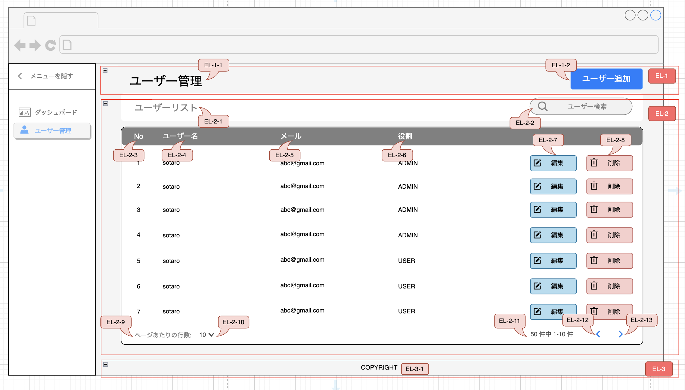

## ユーザ管理画面

### 概要

新しいユーザー管理画面を開発するためのタスクです。この画面には以下の機能が含まれています。

1. **ユーザー一覧**: システムに登録されている全てのユーザーのリストを表示します。各ユーザーには、一意の番号、ユーザー名、メールアドレスがあります。
2. **ロール**: ユーザーのシステム内の役割を示します。例えば 'ADMIN' は管理者で、'USER' は一般ユーザーを意味します。
3. **編集・削除機能**: 各ユーザー情報の右側にある '編集' と '削除' のボタンにより、管理者はユーザーの情報を編集または削除することができます。
4. **ページネーション**: ユーザーのリストをページ分けして表示し、ページ間のナビゲーションを容易にします。

### 画面設計のレイアウト

---

### 画面設計版

#### ヘッダー説明

| ID     | 名称           | テキスト   | 入力データ | エンティティ | 項目   | 位置 | サイズ | 背景色                | 文字色               | イベント       | 参考 |
|--------|--------------|--------|-------|--------|------|----|-----|--------------------|-------------------|------------|----|
| EL-1-1 | ユーザー管理画面タイトル | ユーザー管理 | -     | -      | ヘッダー | 上部 | -   | -                  | [TC-3](#文字色タイプ一覧) | -          | -  |
| EL-1-2 | ユーザー追加       | ユーザー追加 | -     | -      | ボタン  | 上部 | -   | [BGC-3](#背景色タイプ一覧) | [TC-4](#文字色タイプ一覧) | [EVT-1](#) | -  |

#### ボデイー説明

| ID      | 名称         | テキスト    | 入力データ | エンティティ | 項目   | 位置 | サイズ | 背景色                | 文字色               | イベント       | 参考 |
|---------|------------|---------|-------|--------|------|----|-----|--------------------|-------------------|------------|----|
| EL-1-1  | ユーザー一覧タイトル | ユーザーリスト | -     | -      | ヘッダー | 上部 | -   | -                  | [TC-3](#文字色タイプ一覧) | -          | -  |
| EL-2-2  | 検索バー       | ユーザー追加  | -     | -      | ボタン  | 上部 | -   | [BGC-3](#背景色タイプ一覧) | [TC-4](#文字色タイプ一覧) | [EVN-1](#) |    |
| EL-2-3  | ユーザー追加     | ユーザー追加  | -     | -      | ボタン  | 上部 | -   | [BGC-3](#背景色タイプ一覧) | [TC-4](#文字色タイプ一覧) | [EVN-1](#) |    |
| EL-2-4  | ユーザー追加     | ユーザー追加  | -     | -      | ボタン  | 上部 | -   | [BGC-3](#背景色タイプ一覧) | [TC-4](#文字色タイプ一覧) | [EVN-1](#) |    |
| EL-2-5  | ユーザー追加     | ユーザー追加  | -     | -      | ボタン  | 上部 | -   | [BGC-3](#背景色タイプ一覧) | [TC-4](#文字色タイプ一覧) | [EVN-1](#) |    |
| EL-2-6  | ユーザー追加     | ユーザー追加  | -     | -      | ボタン  | 上部 | -   | [BGC-3](#背景色タイプ一覧) | [TC-4](#文字色タイプ一覧) | [EVN-1](#) |    |
| EL-2-7  | ユーザー追加     | ユーザー追加  | -     | -      | ボタン  | 上部 | -   | [BGC-3](#背景色タイプ一覧) | [TC-4](#文字色タイプ一覧) | [EVN-1](#) |    |
| EL-2-8  | ユーザー追加     | ユーザー追加  | -     | -      | ボタン  | 上部 | -   | [BGC-3](#背景色タイプ一覧) | [TC-4](#文字色タイプ一覧) | [EVN-1](#) |    |
| EL-2-9  | ユーザー追加     | ユーザー追加  | -     | -      | ボタン  | 上部 | -   | [BGC-3](#背景色タイプ一覧) | [TC-4](#文字色タイプ一覧) | [EVN-1](#) |    |
| EL-2-10 | ユーザー追加     | ユーザー追加  | -     | -      | ボタン  | 上部 | -   | [BGC-3](#背景色タイプ一覧) | [TC-4](#文字色タイプ一覧) | [EVN-1](#) |    |
| EL-2-11 | ユーザー追加     | ユーザー追加  | -     | -      | ボタン  | 上部 | -   | [BGC-3](#背景色タイプ一覧) | [TC-4](#文字色タイプ一覧) | [EVN-1](#) |    |
| EL-2-12 | ユーザー追加     | ユーザー追加  | -     | -      | ボタン  | 上部 | -   | [BGC-3](#背景色タイプ一覧) | [TC-4](#文字色タイプ一覧) | [EVN-1](#) |    |
| EL-2-13 | ユーザー追加     | ユーザー追加  | -     | -      | ボタン  | 上部 | -   | [BGC-3](#背景色タイプ一覧) | [TC-4](#文字色タイプ一覧) | [EVN-1](#) |    |

#### フッター説明

なし

---

#### 背景色タイプ一覧

| ID　   | 背景色(色彩）      | 参考 |
|-------|--------------|----|
| BGC-1 | 赤色 (#F8CECC) | -  |
| BGC-2 | 灰色 (#666666) | -  |
| BGC-3 | 青色 (#66B2FF) | -  |

#### 文字色タイプ一覧

| ID   | 文字色（色彩）      | 参考 |
|------|--------------|----|
| TC-1 | 灰色 (#999999) | -  |
| TC-2 | 青色 (#0000FF) | -  |
| TC-3 | 黒色 (#000000) | -  |
| TC-4 | 白色 (#FFFFFF) | -  |

