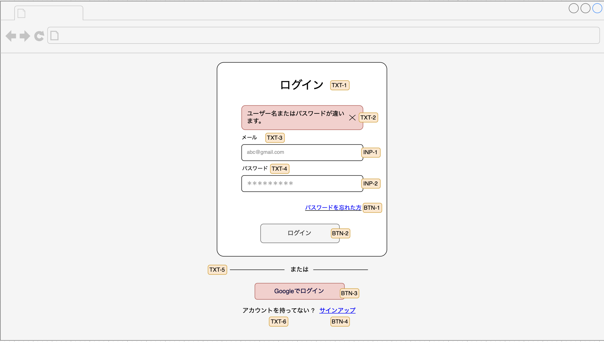

## ログイン画面設計

### 概要

この画面はユーザーがシステムにログインするために使用されます。メールアドレスとパスワードを入力して認証を行い、ログイン後のサービスを利用できるようになります。

### 画面設計のレイアウト

---

### 画面設計版

#### ヘッダー説明

なし

#### ボデイー説明

| ID    | 名称         | テキスト               | 入力データ        | エンティティ | 項目    | 位置 | サイズ | 背景色                | 文字色               | イベント                       | 参考 |
|-------|------------|--------------------|--------------|--------|-------|----|-----|--------------------|-------------------|----------------------------|----|
| TXT-1 | ログインタイトル   | ログイン               | -            | -      | ヘッダー  | 上部 | 大   | -                  | -                 | -                          | -  |
| TXT-2 | エラーメッセージ   | ユーザー名またはパスワードが違います | -            | -      | メッセージ | 中央 | 中   | [BGC-1](#背景色タイプ一覧) | -                 | -                          | -  |
| INP-1 | メールアドレス    | -                  | ユーザーのメールアドレス | -      | 入力欄   | 中央 | 標準  | -                  | [CL-1](#文字色タイプ一覧) | -                          | -  |
| INP-2 | パスワード      | -                  | ユーザーのパスワード   | -      | 入力欄   | 中央 | 標準  | -                  | [CL-1](#文字色タイプ一覧) | -                          | -  |
| BTN-1 | ログインボタン    | ログイン               | -            | -      | ボタン   | 下部 | 標準  | -                  | -                 | [EVT-1 ](button-events.md) | -  |
| BTN-2 | 新規登録       | サインアップ             | -            | -      | リンク   | 下部 | 小   | [BGC-2](#背景色タイプ一覧) | -                 | [EVT-2 ](button-events.md) | -  |
| BTN-3 | Googleログイン | Googleでログイン        | -            | -      | ボタン   | 下部 | 標準  | [BGC-1](#背景色タイプ一覧) | -                 | [EVT-3 ](button-events.md) | -  |
| BTN-4 | パスワード忘れ    | パスワードを忘れた方         | -            | -      | リンク   | 下部 | 小   | -                  | [CL-2](#文字色タイプ一覧) | [EVT-4 ](button-events.md) | -  |

#### フッター説明

なし

---

#### 背景色タイプ一覧

| ID　   | 背景色(色彩）      | 参考 |
|-------|--------------|----|
| BGC-1 | 赤 (#F8CECC)  | -  |
| BGC-1 | 灰色 (#666666) | -  |

#### 文字色タイプ一覧

| ID   | 文字色（色彩）      | 参考 |
|------|--------------|----|
| CL-1 | 灰色 (#999999) | -  |
| CL-2 | 青い (#0000FF) | -  |

