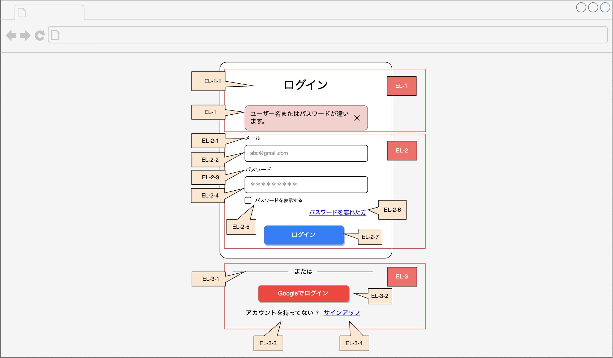

## ログイン画面設計

### 概要

この画面はユーザーがシステムにログインするために使用されます。メールアドレスとパスワードを入力して認証を行い、ログイン後のサービスを利用できるようになります。

### 画面設計のレイアウト

---

### 画面設計版

#### EL-1

| ID     | 名称       | テキスト               | 入力データ | エンティティ | 項目    | 位置 | サイズ | 背景色                | 文字色 | イベント | 参考 |
|--------|----------|--------------------|-------|--------|-------|----|-----|--------------------|-----|------|----|
| EL-1-1 | ログインタイトル | ログイン               | -     | -      | ヘッダー  | 中央 | -   | -                  | -   | -    | -  |
| EL-1-2 | エラーメッセージ | ユーザー名またはパスワードが違います | -     | -      | メッセージ | 中央 | -   | [BGC-1](#背景色タイプ一覧) | -   | -    | -  |

#### EL-2

| ID     | 名称       | テキスト       | 入力データ        | エンティティ | 項目       | 位置 | サイズ | 背景色                | 文字色               | イベント                | 参考 |
|--------|----------|------------|--------------|--------|----------|----|-----|--------------------|-------------------|---------------------|----|
| EL-2-1 | メール      | メール        | -            | -      | テキスト     | 中央 | -   | -                  | [CL-3](#文字色タイプ一覧) | -                   | -  |
| EL-2-2 | メールアドレス  | -          | ユーザーのメールアドレス | -      | 入力欄      | 中央 | -   | -                  | [CL-1](#文字色タイプ一覧) | -                   | -  |
| EL-2-3 | パスワード    | パスワード      | -            | -      | テキスト     | 中央 | -   | -                  | [CL-3](#文字色タイプ一覧) | -                   | -  |
| EL-2-4 | パスワード    | -          | ユーザーのパスワード   | -      | 入力欄      | 中央 | -   | -                  | [CL-1](#文字色タイプ一覧) | -                   | -  |
| EL-2-5 | パスワードを表示 | パスワードを表示する | -            | -      | チェックボックス | 左側 | -   | -                  | -                 | [EVT-4 ](events.md) | -  |
| EL-2-6 | パスワード忘れ  | パスワードを忘れた方 | -            | -      | リンク      | 右側 | -   | -                  | [CL-2](#文字色タイプ一覧) | [EVT-2 ](events.md) | -  |
| EL-2-7 | ログイン実装   | ログイン       | -            | -      | リンク      | 中央 | -   | [BGC-2](#背景色タイプ一覧) | -                 | [EVT-1 ](events.md) | -  |

#### EL-3

| ID     | 名称          | テキスト        | 入力データ | エンティティ | 項目   | 位置 | サイズ | 背景色                | 文字色               | イベント                | 参考 |
|--------|-------------|-------------|-------|--------|------|----|-----|--------------------|-------------------|---------------------|----|
| EL-3-1 | または         | または         | -     | -      | テキスト | 中央 | -   | -                  | [CL-3](#文字色タイプ一覧) | -                   | -  |
| EL-3-2 | Googleログイン  | Googleでログイン | -     | -      | ボタン  | 中央 | -   | [BGC-1](#背景色タイプ一覧) | [CL-3](#文字色タイプ一覧) | [EVT-3 ](events.md) | -  |
| EL-3-3 | アカウントを持ってない | アカウントを持ってない | -     | -      | テキスト | 左側 | -   | -                  | [CL-3](#文字色タイプ一覧) | -                   | -  |
| EL-3-4 | 新規登録        | サインアップ      | -     | -      | リンク  | 右側 | -   | [BGC-2](#背景色タイプ一覧) | -                 | [EVT-5 ](events.md) | -  |

---

#### 背景色タイプ一覧

| ID　   | 背景色(色彩）      | 参考 |
|-------|--------------|----|
| BGC-1 | 赤 (#F8CECC)  | -  |
| BGC-2 | 灰色 (#666666) | -  |

#### 文字色タイプ一覧

| ID   | 文字色（色彩）      | 参考 |
|------|--------------|----|
| CL-1 | 灰色 (#999999) | -  |
| CL-2 | 青い (#0000FF) | -  |
| CL-3 | 黒 (#000000)  | -  |

